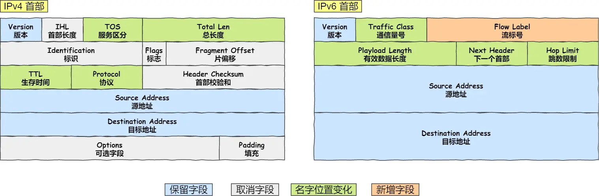

## 第4章 基于TCP的服务端/客户端（1）

### 4.1 理解TCP和UDP

在四层划分的网络协议中，TCP和UDP属于传输层的协议

TCP头部格式：


UDP头部格式：


IP数据头部格式：



### 4.2 实现基于TCP的服务端/客户端


#### TCP服务端的默认函数调用顺序


##### `bind` 函数
```cpp
#include <sys/types.h>         
#include <sys/socket.h>
int bind(int sockfd, const struct sockaddr *addr,
        socklen_t addrlen);
```
参数
- `sockfd`: socket 文件描述符
- `addr`: 绑定的地址信息
- `addrlen`: 地址信息的长度


##### `listen` 函数，进入连接等待请求状态
```cpp
#include <sys/socket.h>
int listen(int sock, int backlog);
// 成功返回0，失败返回-1
```
参数
- `sock`: sock 文件描述符
- `backlog`: 连接请求等待队列的长度，若为5，表示最多使5个请求进入队列

##### 受理客户端连接请求
```cpp
#include <sys/types.h>     
#include <sys/socket.h>
int accept(int sockfd, struct sockaddr *addr, socklen_t *addrlen);
// 成功返回创建的套接字文件描述符，失败返回-1
```
参数：
- `scokfd`: 服务器socket文件描述符
- `addr`: 输出参数，连接的客户端的地址信息
- `addrlen`: 指定`addr` 参数的长度


`accept` 函数受理连接请求等待队列中待处理的客户端连接请求。函数调用成功时，内部将产生用于数据I/O的套接字，并返回其文件描述符。


#### TCP客户端的默认函数调用顺序


`connect` 函数
```cpp
#include <sys/types.h>         
#include <sys/socket.h>
int connect(int sockfd, const struct sockaddr *addr,
            socklen_t addrlen);
// 成功返回0，失败返回-1
```
参数：
- `sock` : 客户端套接字文件描述符
- `ddr`:  保存目标服务器地址信息的变量地址
- `addrlen`:  `addr` 参数的长度


客户端调用 `connect` 函数后，发生以下情况之一才会返回：
- 服务器接收连接请求
- 发送断网等异常情况而中断连接请求

需要注意的，所谓“接收连接” 并不意味着服务器端调用 `accept` 函数，其实是连接请求信息记录到等待队列中（`listen` 函数）。因此 `connect` 函数返回后并不利己进行数据交换。  


> 客户端创建socket后并没有像服务端一样使用 `bind` 绑定addr等信息，其实客户端是在调用 `connect` 函数时由操作系统内核自动创建地址信息，IP是主机的IP,端口随机值。


#### 服务端和客户端函数调用关系


### 4.3 实现迭代服务端/客户端

